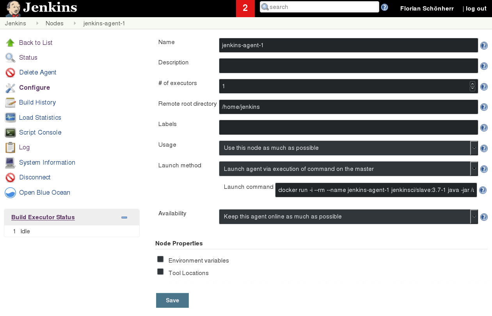
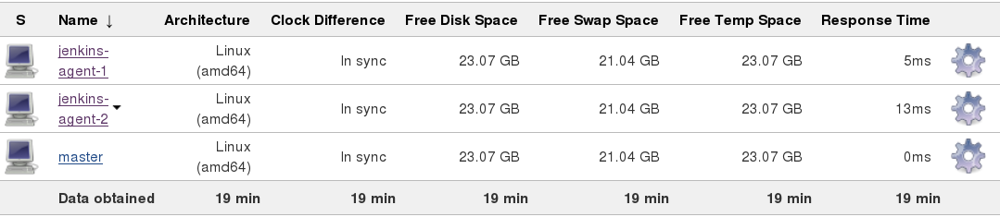
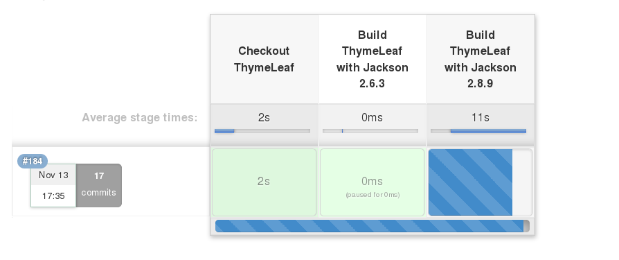
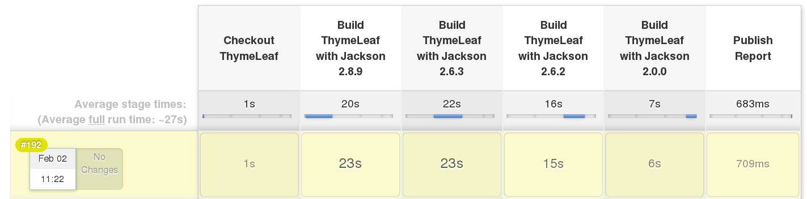
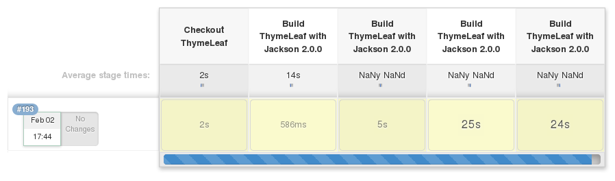
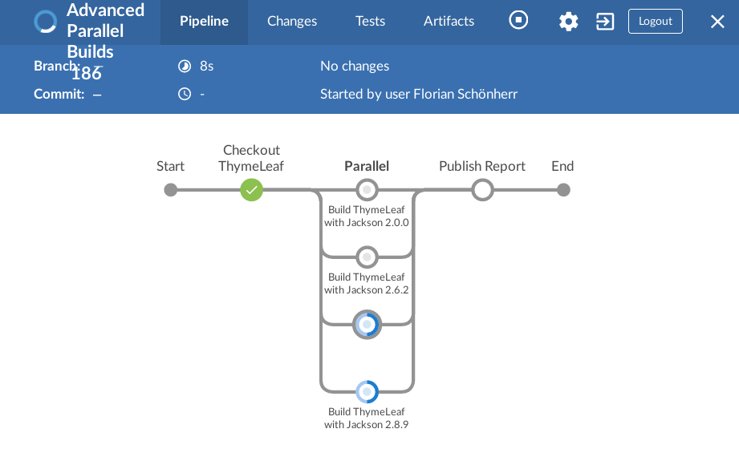
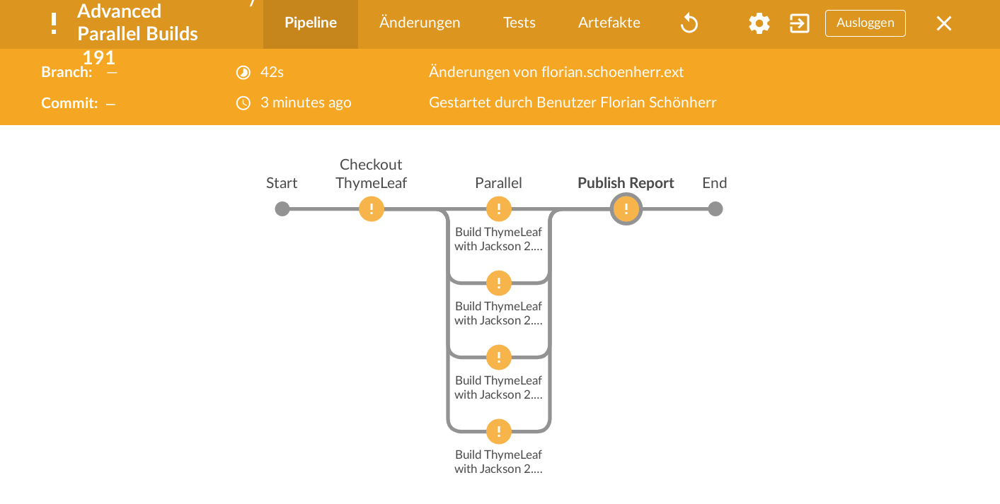
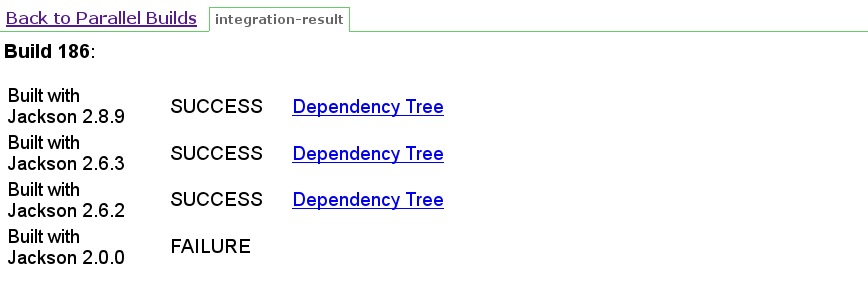

**This is a draft version of the blogpost. Please visit [our homepage](https://comsysto.com/blog-post/parallel-builds-with-jenkins-pipeline) for the final version.**

# Parallel builds with Jenkins Pipeline
[toc]

## Introduction
Since the release of Jenkins 2, its scripted pipeline feature has become a de-facto standard for multi-staged build pipelines. Pipelines have a quite a few advantages over conventional Jenkins builds, among them:

* You can rely on Groovy as a mature scripting language to do all kinds of things that, in earlier versions of Jenkins, were either impossible to achieve or required a multitude of third-party plugins
* You can store the script in version control
* You can use your favorite IDE

### What this blog post is about
One of the features of Jenksin pipelines that you see advertised quite frequently is its ability to run parts of your build in parallel. However, when you start looking for documentation on how this is actually done, you'll find that this is one of Jenkins' features that is covered only briefly in most sources of documentation (including the official one).

Please note that this is not a pipeline tutorial for beginners. If you'd like to have a tutorial on pipelines in general, you should visit the [official documentation](https://jenkins.io/doc/book/getting-started/).

The best existing tutorial on the topic of parallel pipelines found by the authors is ['Creating Multiple Threads'](https://github.com/jenkinsci/pipeline-plugin/blob/master/TUTORIAL.md#creating-multiple-threads), a part of the original [Jenkins Pipeline Tutorial](https://github.com/jenkinsci/pipeline-plugin/blob/master/TUTORIAL.md) that is generally a great and reliable source of information (sadly, the document itself states that it is no longer maintained and points to the official documentation, which doesn't cover parallel builds very extensively). This example is quite complex, but covers only a simple use case - running multiple threads for unit-testing a single build. What is missing is how to run multiple build stages on multiple nodes - something that, in our eyes, is a much more frequently encountered use case.
Some third-party blogs include simple examples of parallel builds, too - but mostly, they stop at showing only the general concept with very little sample code. We were not able to find any documentation beyond the tutorial that has any real meat to it.

To remedy this situation, this blog post aims to:
* Provide a working example for parallel builds that is close to real-world use cases not covered in the tutorial, especially running multiple, possibly diverse build stages in parallel
* Offer details about parallelizing build steps, moving data between them and the possible pitfalls you may encounter

### A word about declarative pipelines
This tutorial is about writing parallel build pipelines in Groovy, in the imperative Jenkins 2 style. Recent versions of Jenkins have introduced yet another format for pipelines that is declarative in nature (meaning that you describe what you _want_ to achive rather than giving commands that describe _how_ to achieve it). For the moment, the Groovy pipeline language is still there and referenced in the official documentation as 'Advanced pipeline syntax'. Since the declarative style is completely new and has not been widely adopted so far, we'll stick to the old style in this post. We suspect that the need for yet another style has arisen as part of Cloudbees' efforts to provide a graphical editor for pipelines as part of the Blue Ocean UI, for which a custom declarative language is generally better suited than Groovy scripts.

### A word about Blue Ocean
Another piece of Jenkins that is a little difficult to understand is the 'Blue Ocean' UI which has been around for some time now and used to be advertised as the future UI for Jenkins.
However, Blue Ocean has not yet replaced the traditional Jenkins UI - you can switch to it by clicking on a link in the navigation bar, but if you are like us, you'll switch back very quickly. That is because, while Blue Ocean looks nice and offers some great visualization (especially for parallel builds, as you'll see below), at the same time it still lacks a lot of features provided by the original UI, and it is currently not forseeable when it will catch up.

In this tutorial, we'll use both UI's and switch forth and back as needed. You'll probably do the same when working with parallel builds.

## Parallel Pipeline - concepts
### The ``parallel`` step
Jenkins provides some online help for pipeline steps in form of the page behind the 'Pipeline Syntax' link that you find in the navigation bar of any pipeline project. When you select 'parallel' and click on the little question mark to the right sight, it displys the following:
```groovy
// Takes a map from branch names to closures and an optional argument failFast
// which will terminate all branches upon a failure in any other branch:
parallel firstBranch: {
    // do something
}, secondBranch: {
    // do something else
},
failFast: true|false
```

You're good to go with this if your branches execute completely different code (e.g. run the builds of two independent projects in parallel). In other cases, you'll generate branches programmatically, for example if they run the same build with different parameters. In this case, you will do something like this:

```groovy
node('master') {
    ... Preparation work ...
}

def branches = [:]

for ( iterable ) {
    def branchName = // ...

    branches[branchName] = {
        node {
            stage(branchName) {
                // ... Run the actual build ...
            }
        }
    }
}

// Give the branches to Jenkins for parallel execution:
parallel branches

node('master') {
    ... Publish buid results ...
}
```
This is a very general template that you can use whenever you generate parallel branches using for loops. We'll use it in our example, too.

## The example: Integrating Thymeleaf and Jackson
In our current project, we are facing the situation that a lot of application modules depend on a specific 'infrastructure' module that is itself under continuous development. Whenever something changes, we need to verify that all dependent modules can be built with the most recent version. In order to improve the duration of this backwards compatibility check, we are using a CI pipeline that runs the integration of all dependent modules in parallel, each as a separate build stage.
Use cases like this one can be found in most companies, but sharing them with the public for educational reasons is often impossible due to disclosure restrictions or because they simply cannot be easily explained to someone outside the project. This may be the main reason why it is so difficult to find any example on the internet for parallelizing complete build stages.

To provide a working example with some real meat to it, we have rather arbitrarily chosen the [Thymeleaf](http://www.thymeleaf.org/) Open Source project, which is a template engine for web servers. In this case it's purpose is actually not very important - we just need a project that has some dependencies.

Thymeleaf uses the JSON parser/generator library [Jackson](https://github.com/FasterXML/jackson). We'll build a CI pipeline that builds Thymeleaf against multiple versions of Jackson (2.8.9, 2.6.3, 2.6.2 and 2.0.0) and produces a report that shows which of them were successful.

### Prerequisites and Setup
In order to run the examples in this tutorial your environment should meet some requirements that are outlined in this section, concerning:
* The software on your Jenkins server
* Required Jenkins plugins
* Configuration

#### Installed software
1. [Jenkins](https://jenkins.io/) - obviously, you need a Jenkins build server to complete this tutorial. You should have admin access on this instance because you will need to:

    * Install plugins and configure nodes using Docker
    * Create and configure a pipeline project
    * Manage In-process Script Approval if installed

2. [Docker](https://www.docker.com/) - if you don't have a real system with at least two build slaves, you will use Docker to create virtual worker nodes

#### Plugins
To do this tutorial, you'll need to have some plugins installed. Most likely you'll be fine if you've used Jenkins pipelines before (if you have not, this tutorial may not be the right one for you). In any case, here is a list of plugins you should make sure to have installed:
* [Blue Ocean plugin](https://wiki.jenkins.io/display/JENKINS/Blue+Ocean+Plugin)
* [Pipeline: Basic Steps](https://plugins.jenkins.io/workflow-basic-steps)
* [Pipeline: Nodes and Processes](https://plugins.jenkins.io/workflow-durable-task-step)
* [Git plugin](https://plugins.jenkins.io/git)
* [Html Publisher plugin](https://jenkins.io/doc/pipeline/steps/htmlpublisher/)

#### Configuration
##### Slave nodes
The only other step to prepare your Jenkins for this tutorial is to make sure you have some slave nodes available that can execute your parallel pipeline (of course, you could execute the pipeline on a Jenkins that only has a master node if you remove the ``!master`` constraint - but then, Jenkins would execute the build one stage after another).
If you already have at least two slave nodes configured, you are fine - continue with the next section.
Otherwise, you should now create some slaves. You do not need another machine for it if yours is able to run Docker. Open the node configuration and select 'New Node'. You should see a dialog like this:



Edit the configuration as shown in the image. The most important part is, of course, the launch command (you may have to adjust this a little depending on your OS and the installed Jenkins version):

```sh
docker run -i --rm --name jenkins-agent-1 jenkinsci/slave:3.7-1 java -jar /usr/share/jenkins/slave.jar
```

Set up at least two nodes like this. Afterwards, your nodes configuration should look like this:



##### Create a pipeline project
Last but not least, you should create the actual pipeline project. We assume that you are familar with this process, so we'll outline only the general parameters.
* It should be a none-multibranch pipeline build
* If you want to modify the pipeline, we recommend that you fork our repository (https://github.com/comsysto/jenkins-lab-shared-pipeline) and work from there
* Definition: ``Pipeline from SCM``
* SCM: ``Git``
* Repositories: _your Git repository_
* Script path: ``parallel-builds/Jenkinsfile``

Now you have the setup finished. Let's go and run it.

## Running the pipelines
Simple click on 'Build now'. The pipeline should start and, depending on your machine, finish in a timeframe from 30 seconds to 120 seconds.



If it seems to hang after the first stage, check if your slave nodes have actually started up successfully!
After the pipeline has completed, you should see this:



The pipeline is now displayed in yellow color, meaning it is 'unstable'. This isn't a mistake because we do not consider the build as 'failed' if one of the parallel stages fail (actually, we know quite well that Thymeleaf doesn't build with Jackson 2.0.0, so this sample pipeline should never become green).
Please not that if your pipeline is red instead, something went wrong (in this case, you should look at the console log and see what failed).

## The Pipeline Script
Let's now have look at the actual pipeline script that we were running (we just provide excerpts here for the sake of readability - you can view the whole [Jenkinsfile](https://github.com/comsysto/jenkins-lab-shared-pipeline/blob/master/parallel-builds/Jenkinsfile) at our Github project).  

The general layout of the script follows the template we introduced earlier, with some modifications. First, we run a single thread on the master node to checkout ThymeLeaf and stash it:
```groovy
node('master') {
    stage('Checkout ThymeLeaf') {
        git url: 'https://github.com/thymeleaf/thymeleaf.git',
            branch: '3.0-master'
        stash name: 'thymeleaf-sources',
              includes: 'pom.xml,src/*'
    }
}
```
Why do we do this? We could also checkout from Git later on the build slaves. In that case, however, we'd checkout once for each build or even more times if we want to clean the workspace between builds on the same slave. To avoid this redundancy, we check Thymeleaf out once and then put its files on Stash - the preferred way to transport non-transient build data between nodes.

Next, we'll define our parallel branches:

```groovy
List<StageDef> stageDefs = [
        new StageDef("2.8.9"),
        new StageDef("2.6.3"),
        new StageDef("2.6.2"),
        new StageDef("2.0.0")]
```

We will use this list to loop through the versions of Jackson we want to check for compatibility with Thymeleaf. The 'StageDef' structure is actually so simple that we could as well have used a simple string instadt, but we chose this more complicated variant to serve as a template for real-world stage definitions that may contain more data, for example additional library dependencies or branch-individual settings.

Next, we define our parallel stages:

```groovy
def branches = [:]

// Loop through the stage definitions and define the parallel stages:
for (stageDef in stageDefs) {

    // Never inline this!
    String jacksonVersion = stageDef.jacksonVersion

    String branchName = "Build ThymeLeaf with Jackson " + jacksonVersion
    String outFileName = "thymeleaf-with-jackson-${jacksonVersion}.dependencies"

    branches[branchName] = {

        // Start the branch with a node definition. We explicitly exclude the
        // master node, so only the two slaves will do builds:
        node('!master') {
            withEnv(["PATH+MAVEN=${tool 'Maven 3'}/bin"]) {
                stage(branchName) {
                    try {
                        // First, unstash thymeleaf:
                        unstash name: 'thymeleaf-sources'

                        // Run the build, overwriting the Jackson version. We
                        // also need to skip the integrity check since we don't
                        // have access to the private signing key:
                        sh "mvn -B clean install -Djackson.version=${jacksonVersion} -Dgpg.skip=true"

                        // Store the current dependency tree to a file and stash
                        // it for the HTML report:
                        sh "mvn -B dependency:tree -Djackson.version=${jacksonVersion} | tee target/${outFileName}"
                        stash name: outFileName, includes: "target/${outFileName}"
                    }
                    catch (ignored) {
                        currentBuild.result = 'UNSTABLE'
                    }
                }
            }
        }
    }
}
```

What's happening here?
1. For each stage definition, we create a new branch with a name (indicating the Jackson version to be integrated) and an output file that will contain the current dependency tree.
2. Inside the branch, we first acquire a slave node (all material work in a jenkins pipeline needs to be wrapped in a ``node``) and put a ``stage`` in it (it has the same name as the branch, which is convenient in our case, but not required). Always put a ``stage`` inside a ``node``, not the other way around!
3. We then unstash the Thymeleaf sources and build them, calling Maven using the ``sh`` build step. The Jackson version is wired inside the build, of course, but we forcibly override it using a ``-D`` command line switch. After that's done, we call Maven again to produce a dependency tree.
4. If any exception is thrown during the build, we set the result to 'UNSTABLE'. Normally, this should happen only when building against the incompatibe Jackson 2.0.0.

Please note that global variables like ``stageDef`` must be serializable, because Jenkins needs to marshall them for transport to the slave nodes! Non-serializable variables may be used only when isolated within a separate function. This is described in detail in the respective part of the [pipeline tutorial](https://github.com/jenkinsci/pipeline-plugin/blob/master/TUTORIAL.md#serializing-local-variables).


#### A possible pitfall: Inlining stage definitions
You may stumble about the comment in line 6: _'Never inline this!'_.
This is a pitfall that is well known to experienced Groovy programmers, but may come as a time-consuming surprise to people better versed in other programming languages (e.g. Java). You'll encounter the issue if you do something like this:
```groovy

for (stageDef in stageDefs) {
    branches[branchName] = {

        node('!master') {
            withEnv(["PATH+MAVEN=${tool 'Maven 3'}/bin"]) {

                // Here is the big issue - stageDef is inlined:
                stage("Build ThymeLeaf with Jackson " + stageDef.jacksonVersion) {
                    // ...
                }
            }
        }
    }
}
```
You can see the result immediately on the pipeline:


Every stage builds now against Jackson 2.0.0. But why?

The answer is that Groovy has a quirk when creating closures inside for loops: the closure gets a reference to the loop variable which is **not** local to the code block inside the loop, and because the loop variable is mutated on the next iteration, its value inside the closure is, too!
As a remedy for this problem, you must follow a simple rule: **always** copy the stage definition or its contents to a local variable inside the for loop (but outside the closure), before using it in the closure. You can read about this issue in more detail [here](http://blog.freeside.co/2013/03/29/groovy-gotcha-for-loops-and-closure-scope/).

### Blue Ocean: visualizing parallel build's progress
One disadvantage of the standard pipeline view is that you can't see very well how the parallel steps progress, because the pipeline is linear, like ... a pipeline. This issue has been addressed by Jenkins by providing an alternate view: Blue Ocean.

If you have installed Blue Ocean, you should see a link 'Blue Ocean' on the navigaion bar to the left. Click on it now, and Jenkins will change its face:



This looks nice and provides great visualization for parallel pipeline stages. As you will realize, it also has its disadvantages:
* It is full screen - while Blue Ocean is active, you have no access to the normal UI's features
* Console logs are displayed directly below the pipeline and Jenkins jumps frequently to the end - this is deadly when logs become larger than the screen, because you can't see the pipeline anymore

You can leave Blue Ocean anytime: just click on the right-hand arrow left of the 'Logout' button (don't click on the 'Logout' button itself, because it does what it says).


### What about stage-specific result colors?
You may have noticed that the pipeline will be colored fully yellow after the build. The same is the case with Blue Ocean:


So, why don't we color the individual stages in red or green, depending on the build result? The answer is simple: this is not (yet) possible with Jenkins pipeline. A build status is global for the whole pipeline. Individual error status of stages seems to be a feature that is frequently asked for by users and very difficult to solve by the developers, as you can determine e.g. from [JENKINS-39203](https://issues.jenkins-ci.org/browse/JENKINS-39203) and the related [JENKINS-43995](https://issues.jenkins-ci.org/browse/JENKINS-43995).

### The alternative: HTML Reports
As a workaround for Jenkins' inability to display the pipeline stages in different colors, we resort to creating the report ourselves. To achieve this, we use the [Html Publisher  plugin](https://jenkins.io/doc/pipeline/steps/htmlpublisher/) and, after the parallel builds have completed, put together some simple HTML that can be accessed on the build's navigation bar:
```groovy
node('master') {
    stage('Publish Report') {
        sh "mkdir -p target"
        writeFile file: "target/integration-result.html",
                  text: buildHtmlReport(stageDefs)
        publishHTML([
                allowMissing         : false,
                alwaysLinkToLastBuild: true,
                keepAll              : true,
                reportDir            : 'target',
                reportFiles          : 'integration-result.html',
                reportName           : 'Integration result'])
    }
}

private String buildHtmlReport(List<StageDef> stageDefs) {
    // ... HTML header here ...
    for (stageDef in stageDefs) {
        String jacksonVersion = stageDef.jacksonVersion
        String outFileName = "thymeleaf-with-jackson-${jacksonVersion}.dependencies"

        // Determine the success of the build based on presence/absence of the
        // dependency tree file on stash:
        try {
            unstash name: outFileName
            success = true
        }
        catch (ignored) {
            success = false
        }

        // ... put together some HTML here that shows the build result ...
    }
    // ... HTML footer here ...
    return s
}
```

We rely on the fact here that the dependency tree info is only written/stashed if the Maven build succeeded (you can make this more complex, of course, but you will have to write your build result to stash in order to process it here).

The output looks like this:



## Conclusion
We hope that you have enjoyed reading this post and that we could provide you with some useful insights on actually using Jenkins Pipeline for parallel builds, especially concerning the various quirks and pitfalls we encountered while working with this feature:
* The requirement for full serializability
* Using stash and unstash to transport data between worker nodes
* The Groovy closure quirk
* How to build HTML reports to remedy the lack of build result information on the pipeline views

We'll of course be happy to hear from you if you have additional knowledge to share on this topic, or if you find a bug in our code. Thanks for reading!

# References
* jenkins.io: [Jenkins User Handbook](https://jenkins.io/doc/book/getting-started/)
* Jesse Glick et al. - 2014-2017: [Jenkins Pipeline Tutorial](https://github.com/jenkinsci/pipeline-plugin/blob/master/TUTORIAL.md#creating-multiple-threads)
* Michael Neale - Sep 2015: [Parallelism and Distributed Builds with Jenkins](https://www.cloudbees.com/blog/parallelism-and-distributed-builds-jenkins)
* ad-hockery.com - Mar 2013: [Groovy gotcha: for loops and closure scope](http://blog.freeside.co/2013/03/29/groovy-gotcha-for-loops-and-closure-scope/)
